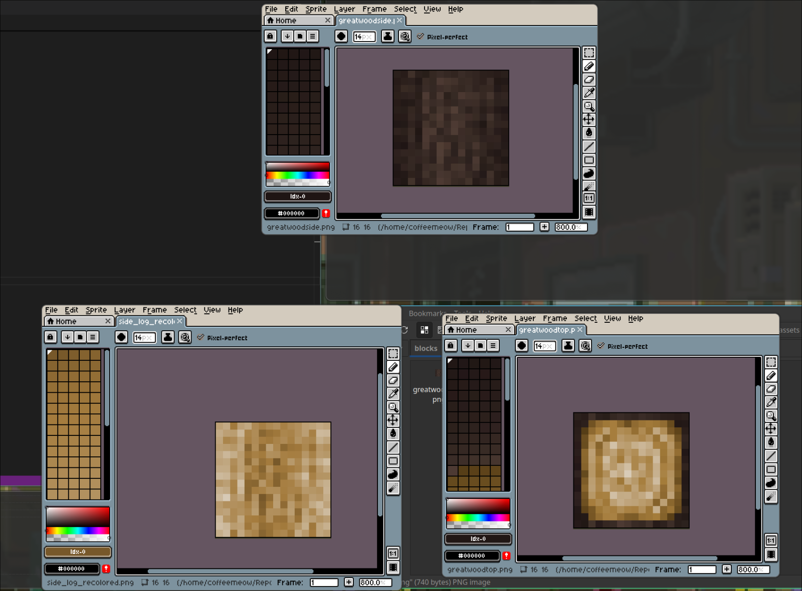

# WoodStripper
### It stripps wood. What did you expect?

Simple python script which allows you to turn minecraft unstripped logs texture to stripped one

How it works?
- We take log_top.png and log_side.png on input
- We extract central piece without bark from top side (cutted border size configurable, 1 pixel by default)
- We get two pallets: from this cutted piece and from side
- We count unique colors in both
- If top palette is lesser than side one we interpolate it to side palette size
- We replace side colors with interpolated top palette (we always use all colors no matter what, every unique top color matches only one unique side color)
- Done!

TODO:
* Rewrite this mess
* Add bark recognition algorithm
* Add top side bark color conversion
* Add batch processing
* Add CLI

Example result:
